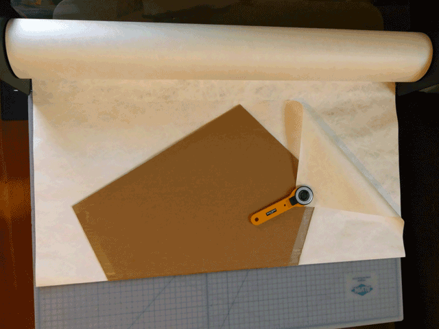

# Stormy's Sled Kite

This is a repository for my version of Stormy O. Weathers' Horned Allison Sled kite. It is easy to assemble and a great first kite. It flies in winds ranging from 4-20 mph at a high angle, is stable without a tail, and resists collapsing in a cross breeze.

The design has been optimized for quick assembly in workshops and for easy decoration. A 36" roll of Tyvek can make 75 two foot tall kites or 38 three foot tall kites. The 15" version can be made from a Tyvek express mail envelope.

## contribute

You can contribute to this design by:

* Replicating the kite and documenting your use of it. Please [reach out](http://headfullofair.com/contact) and share.
* Forking this repository and improving the design documentation, or assembly instructions.
* Adding your comments to [open issues in this repository](/issues).

All contributors are asked to abide by the [code of conduct](codeofconduct.md).

## background
The design is an amalgam of Stormy's instructions and his notes on kite fishing (pages 10 & 95 of his book, [The Best Kite in the World](http://www.drachen.org/collections/best-kite-world)). Paper-like Tyvek has replaced plastic bags as the kite material, because it lays flat and doesn't need to be hemmed, speeding up kite assembly. Pre-cut dowels are used instead of straws for consistency, and the kite patterns are sized so that little or no cutting is needed. With the exception of the strapping tape, the kite components are recyclable or biodegradable.

## MATERIALS:

* Type 10 Tyvek in white (1025D) or black. (1.25oz/yard). *From [Material Concepts](https://shop.materialconcepts.com/prodcat/tyvek-uncoated-graphics.asp)*
* 3/4" artist tape. *From [Dick Blick](https://www.dickblick.com/products/artist-tape/)*
* 1/8" birch dowels. Cut a 48" dowel in half for the 24" version, buy 36" dowels for the 36" version. *From [McMaster-Carr](https://www.mcmaster.com/#birch-dowels)*
* 3/8" fiber-free polypropylene strapping tape (Tesa 4288). *From [Uline](https://www.uline.com/Product/Detail/S-2056/Strapping-Tapes/Tesa-4288-Strapping-Tape-3-8-x-60-yds-Black)*.
* about 12 feet of 50 lb string for the bridle. Waxed linen is my favorite. *From [Dick Blick](https://www.dickblick.com/products/books-by-hand-waxed-linen-thread/)*

##### substitute materials

* Artist tape is the same as "lab tape." The artist tape is stiff and lends stability to the birch dowels, but it can be replaced with masking tape or cut up mailing labels.

* strapping tape can be replaced with the adhesive on a Tyvek express mail envelope, or with fiberglass strapping tape or strips of heavy-duty duct tape, both of which are inferior. 

* Birch dowels can be replaced with thick straws on the 24" version, pushed end into end (McDonalds straws or milkshake straws). Using straws, a 1.25" artist tape or masking tape is recommended. 

* Any 50lb string can be used for the bridle.

## PATTERNS

For workshops, I recommend transfering the kite pattern to a piece of cardboard. Cutting a half pattern on a folded piece of material is the best way to assure symmetry. 

* Print the half-pattern out full size, or tiled on 8.5"x11" paper.
  * [36" version](36in-stormysled-half-pattern.pdf), [36" version tiled 8.5"x11"](36in-stormysled-half-pattern-85x11-tiled.pdf)
  * [24" version](24in-stormysled-half-pattern.pdf), [24" version tiled 8.5"x11"](24in-stormysled-half-pattern-85x11-tiled.pdf)
  * [15" version](15in-stormysled-half-pattern.pdf), [15" version tiled 8.5"x11"](15in-stormysled-half-pattern-85x11-tiled.pdf) (for Tyvek envelopes)
* (If you want to change the pattern, the master pattern is [stormysled.dxf](stormysled.dxf), and is for the 3' high kite. It was created in [QCAD](https://qcad.org/en/).  

## Assembly

* Cut out the sail. Decorate the kite. 
* Tie two loops on the end of the bridle string.
* Tape the strapping tape down to one side, and slide the bridle loops into place. Wrap strapping tape around to the back side.

* Add a small piece of paper tape to hold the strapping tape in place. 
* Tape the spars on, wrapping the tape tight around them.

 

* Add a bridling loop in the middle of the bridle. 

Go fly your kite!

## Kite storage

*Store your kite by folding and rolling it up with the bridle in the middle:*

